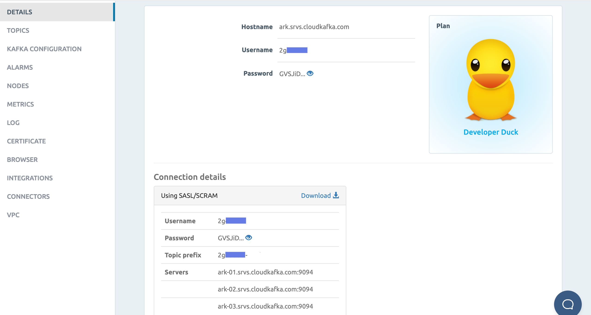

# `springboot-cloudkarafka`

The goal of this project is to implement a [`Spring Boot`](https://spring.io/projects/spring-boot) application that
_produces_ messages to a [`Kafka`](https://kafka.apache.org/) topic and another `Spring Boot` application that
_consumes_ those messages. Similar projects are: [`springboot-spring-kafka`](https://github.com/ivangfr/springboot-spring-kafka)
and [`spring-cloud-stream-elasticsearch`](https://github.com/ivangfr/spring-cloud-stream-elasticsearch).

However, in this one, when the profile `cloudkarafka` is used, `producer` and `consumer` will connect to a `Kafka`
that is located in a cloud-based messaging service called [`CloudKarafka`](https://www.cloudkarafka.com/). When running
the applications with `default` profile, `producer` and `consumer` will connect to `Kafka` that is running locally in a
`Docker` container.

## Examples

### [spring-kafka](https://github.com/ivangfr/springboot-cloudkarafka/tree/master/spring-kafka)

In this example, we use [`Spring Kafka`](https://docs.spring.io/spring-kafka/reference/html/) library to implement the
configuration between `Spring Boot` applications and `Kafka`.

### [spring-cloud-stream](https://github.com/ivangfr/springboot-cloudkarafka/tree/master/spring-cloud-stream)

Here, we use [`Spring Cloud Stream`](https://docs.spring.io/spring-cloud-stream/docs/current/reference/htmlsingle/)
library to implement the configuration between `Spring Boot` applications and `Kafka`.

## CloudKarafka Configuration

First of all, access https://www.cloudkarafka.com/ and create an account. There is the `Developer Duck` plan that is
totally free.

Once you log into `CloudKarafka`, click on `Details` menu. You should see something like the picture below. In
this page you have all the credentials and the URLs of the `Kafka` brokers.



In order to get information about the topic you will use, click on the `Topics` menu.


You can use the default topic or create a new one. In my case, I created a new one with suffix `news.json`.

## Starting Kafka as Docker container

If you prefer to run everything locally in your machine, i.e, `producer`, `consumer` and `Kafka`, run the command
below. It will start all container needed to have a `Kafka` broker running locally.
```
docker-compose up -d
```

### Useful links

#### Kafka Topics UI
     
`Kafka Topics UI` can be accessed at http://localhost:8085

#### Kafka Manager
     
`Kafka Manager` can be accessed at http://localhost:9000

**Configuration**

- First, you must create a new cluster. Click on `Cluster` (dropdown on the header) and then on `Add Cluster`
- Type the name of your cluster in `Cluster Name` field, for example: `MyZooCluster`
- Type `zookeeper:2181` in `Cluster Zookeeper Hosts` field
- Enable checkbox `Poll consumer information (Not recommended for large # of consumers if ZK is used for offsets tracking on older Kafka versions)`
- Click on `Save` button at the bottom of the page.
